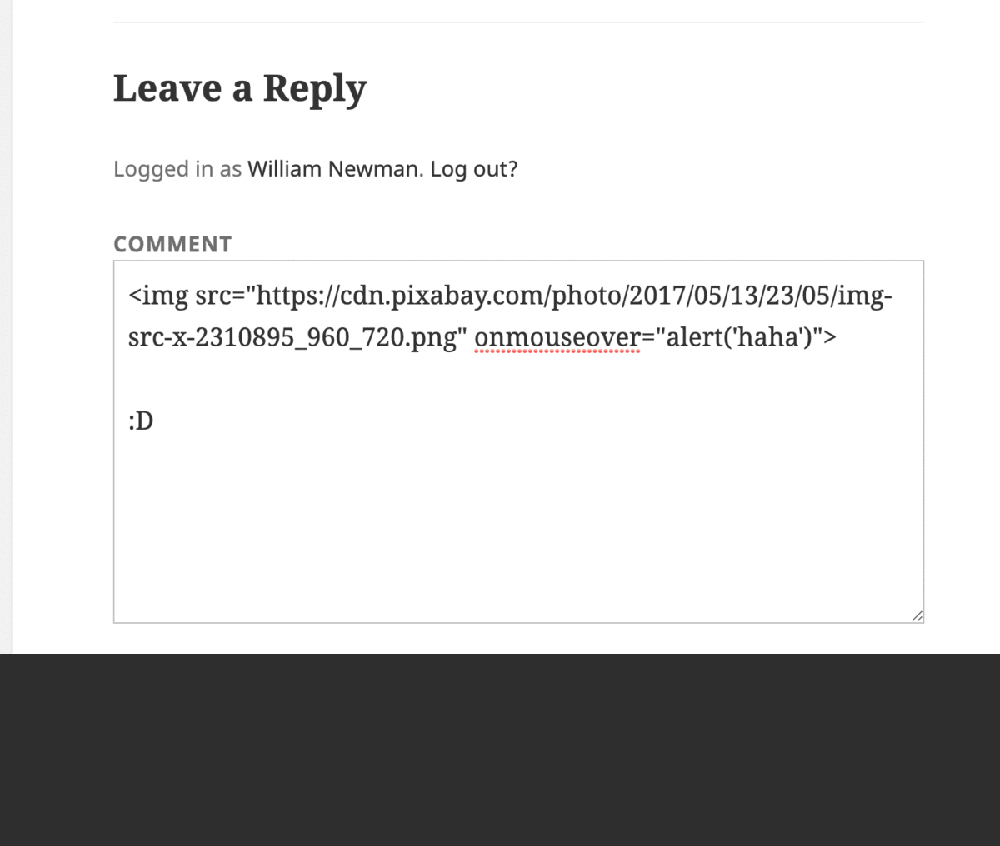
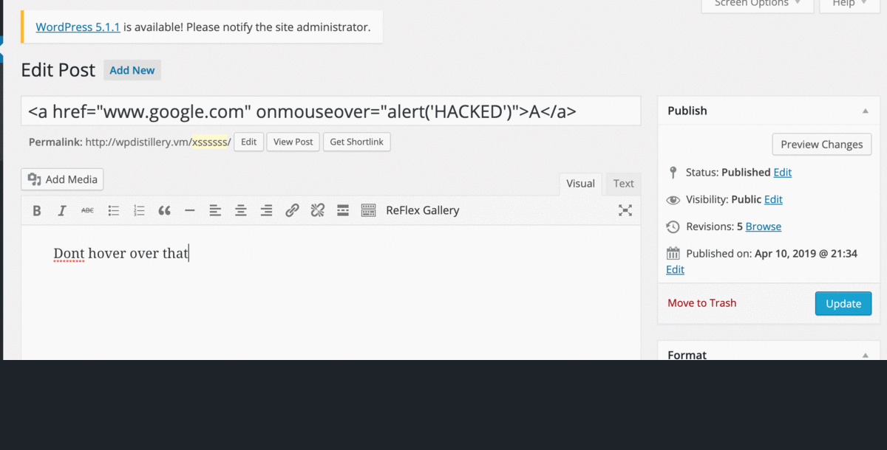
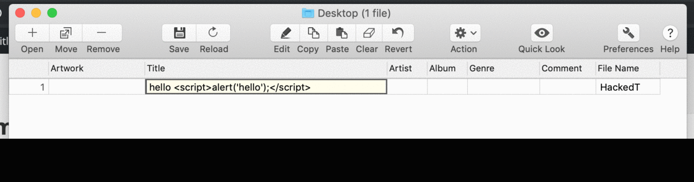

# Project 7 - WordPress Pentesting

Time spent: 9 hours spent in total

> Objective: Find, analyze, recreate, and document **five vulnerabilities** affecting an old version of WordPress

## Pentesting Report

1. Authenticated Stored XSS
  - [ ] Summary: Leave a comment on a post and in the comment insert an img tag with javascript so as to trigger an alert when a user hovers over the image
    - Vulnerability types: XSS
    - Tested in version: 4.2
    - Fixed in version: 4.2.1 
  - [ ] GIF Walkthrough: 
  - [ ] Steps to recreate:
    1. Create a new post and insert an img tag like this 
    2. When a user hovers over the img an alert should appear
  - [ ] Affected source code:
  - [Authenticated Stored XSS Source](https://core.trac.wordpress.org/browser/branches/4.2/src/wp-admin/includes/image.php)

2. XSS in Page Name Through a Tag  
  - [ ] Summary: XSS where you embed javascript in an html a tag in a WP page title as to trigger an alert when user hovers over it.
    - Vulnerability types: XSS
    - Tested in version: 4.2
    - Fixed in version: 4.2.4
  - [ ] GIF Walkthrough:
  - [ ] Steps to recreate:
  1. Create a new post
  2. Change the title to <a href="www.google.com" onmouseover="alert('HACKED')">A</a>
  3. Publish Post
  4. Have user hover over post
  - [ ] Affected source code:
    - [XSS Page Name Source](https://core.trac.wordpress.org/browser/branches/4.2/src/wp-includes/kses.php)

3. Authenticated XSS Through MP3 Title Metadata 
  - [ ] Summary: Upload an mp3 file, change the title in the metadata using an appropriate application to include a script tag with javascript inside of it. Then when an admin goes to view attachment page it triggers the javascript in the script tag.
    - Vulnerability types: XSS
    - Tested in version: 4.2
    - Fixed in version: 4.7.3
  - [ ] GIF Walkthrough:
  - [ ] Steps to recreate:
    1. Create an mp3 that is under 2mb
    2. Change the files title in its metadata to include 
    3. Upload the file
    4. Go to view attachment page
    5. See the alert
  - [ ] Affected source code:
    - [XSS Page Name Source Link 1](https://core.trac.wordpress.org/browser/branches/4.2/src/wp-includes/media.php)
    - [XSS Page Name Source Link 2](https://core.trac.wordpress.org/browser/branches/4.2/src/wp-includes/js/mediaelement/wp-playlist.js)

## Assets
[mp3](HackedT.mp3)

## Resources

- [WordPress Source Browser](https://core.trac.wordpress.org/browser/)
- [WordPress Developer Reference](https://developer.wordpress.org/reference/)

## Notes

I had some difficulty with editing the mp3s metadata seeing as I did not have the appropriate software on my mac. I ended up having to download 3rd party software to deal with thi.

## License

    Copyright [2019] [William Newman]

    Licensed under the Apache License, Version 2.0 (the "License");
    you may not use this file except in compliance with the License.
    You may obtain a copy of the License at

        http://www.apache.org/licenses/LICENSE-2.0

    Unless required by applicable law or agreed to in writing, software
    distributed under the License is distributed on an "AS IS" BASIS,
    WITHOUT WARRANTIES OR CONDITIONS OF ANY KIND, either express or implied.
    See the License for the specific language governing permissions and
    limitations under the License.

